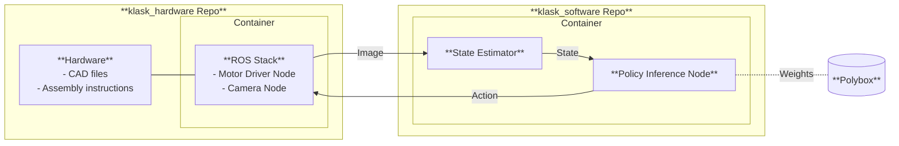

# KLASK Robotic Hardware Stack

**Autonomous robotic KLASK game platform for reinforcement learning research and education.** This repository contains everything you need to build and control a robotic KLASK table: ROS2 nodes for vision processing and motor control, CAD files for mechanical components, and comprehensive documentation.

<!-- CI pipeline (Colcon build and test) -->
<a href="https://github.com/IDSCETHZurich/klask_hardware/actions/workflows/ci.yml">
  
</a>

<!-- Docs pipeline (MkDocs/Doxygen build) -->
<a href="https://github.com/IDSCETHZurich/klask_hardware/actions/workflows/docs.yml">
  
</a>

<!-- Docs site status -->
<a href="https://IDSCETHZurich.github.io/klask_hardware/">
  
</a>

<!-- Stars (social) -->
<a href="https://github.com/IDSCETHZurich/klask_hardware/stargazers">
  
</a>

<!-- Contributors -->
<a href="https://github.com/IDSCETHZurich/klask_hardware/graphs/contributors">
  
</a>

<!-- Releases -->
<a href="https://github.com/IDSCETHZurich/klask_hardware/releases">
  
</a>

## Documentation & Tutorials

All documentation lives at [https://IDSCETHZurich.github.io/klask_hardware/](https://IDSCETHZurich.github.io/klask_hardware/). You'll find guides for:

- **Hardware Assembly:** Mechanical assembly, wiring, and component installation
- **Runtime Startup:** Launching the system and running the autonomous game
- **Development Setup:** Environment configuration, Docker containers, and building documentation
- **Code Guidelines:** Coding standards and best practices
- **API Reference:** Full Doxygen documentation for all ROS2 packages

## What is the KLASK Robotic System

KLASK is a popular magnetic table game where players control magnetic pegs to hit a ball into the opponent's goal while avoiding obstacles. Researchers and students at the **Institute for Dynamic Systems and Control** (IDSC), ETH Zurich, have developed an autonomous robotic platform that can play KLASK using advanced reinforcement learning algorithms. The system provides the ability to test, benchmark and improve RL strategies in a real-world environment.

This repository contains the hardware and software components required to build and operate the KLASK robotic system. The inference node running the RL agent is hosted in the separated [klask_software](https://github.com/IDSCETHZurich/klask_software) repository.



## System Architecture

The system consists of three main ROS2 packages:

### klask_imaging_pkg (Python)

Vision processing pipeline for real-time board detection:

- Camera acquisition and calibration
- Board detection and perspective transform
- Image publishing
- Image viewer for debugging

### klask_motor_commander_pkg (C++)

Motor control and coordination:

- ODrive motor interface with corexy kinematics
- Player peg synchronization and homing
- Wall collision avoidance
- Velocity profiling and feedforward control

### klask_interfaces

Custom ROS2 messages, services, and actions for system communication

## Hardware Components

This repository includes:

- **CAD Files** (`hardware/cad/`) SolidWorks assemblies and parts for mechanical structure
  - Gantry frame and mounting brackets
  - Motor assemblies and belt attachments
  - Camera mount and board frame
  - Custom game board adapter components

- **Third-Party Parts** References to commercial components (bearings, motors, profiles)

See the [Hardware Assembly tutorial](https://IDSCETHZurich.github.io/klask_hardware/tutorials/01-hardware-assembly/) for complete build instructions.

## Roadmap

We track work in GitHub issues and milestones.

## Contributing

We welcome contributions! Whether you're fixing bugs, adding features, or improving documentation:

1. **Fork** the repository and create a feature branch
2. **Develop** following our [code guidelines](https://IDSCETHZurich.github.io/klask_hardware/contribution/code_guideline/)
3. **Test** your changes thoroughly
4. **Submit a PR** with a clear description and context

See our [Contributing Guide](https://IDSCETHZurich.github.io/klask_hardware/contribution/contributing/) for detailed information.

## Maintainers

This project is mostly maintained by:

- [Aswin](https://github.com/akrv) - Lead Researcher
- [Tobias](https://github.com/MeierTobias) - Student

## Citing

If you use this work in an academic context, please cite the following publication:

- Authors, **"Title"**, 2023. ([PDF](link_to_pdf))

    ```bibtex
    @article{,
      title={},
      author={},
      journal={},
      year={2026}
    }
    ```

## License

- ROS2 code and software is licensed under [**AGPL-3.0**](LICENSE-AGPL-3.0)
- Hardware designs (CAD, mechanical) are under [**CERN-OHL-S v2**](LICENSE-CERN-OHL-S-2.0)
- Documentation and tutorials are under [**CC BY 4.0**](LICENSE-CC-BY-4.0)

### Third-party Components

- Dependencies and libraries retain their original licenses

## Acknowledgements

- ETH Zurich's **Institute for Dynamic Systems and Control** for project support
- All students and researchers involved in the KLASK project
- The ROS2 and open-source robotics community
- ODrive project for excellent motor control hardware and software
- All contributors and maintainers who make this project possible
